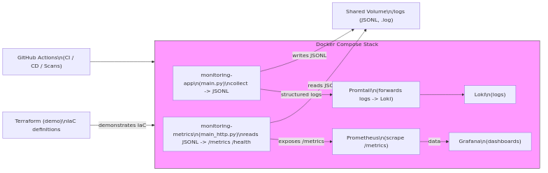
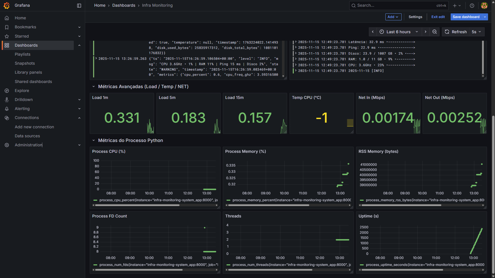

# 🖥️ Infra Monitoring System

[](https://github.com/Jeferson681/infra-monitoring-system/actions/workflows/ci.yml)
[](https://github.com/Jeferson681/infra-monitoring-system/actions/workflows/cd.yml)
[](https://github.com/Jeferson681/infra-monitoring-system/actions/workflows/tests-coverage.yml)
[](https://github.com/Jeferson681/infra-monitoring-system/actions/workflows/dependabot/dependabot-updates)
[](https://github.com/Jeferson681/infra-monitoring-system/actions/workflows/gitleaks-scan.yml)
[](https://github.com/Jeferson681/infra-monitoring-system/actions/workflows/snyk-scan.yml)
[](https://github.com/Jeferson681/infra-monitoring-system/actions/workflows/trivy-scan.yml)
[](https://github.com/Jeferson681/infra-monitoring-system/actions/workflows/terraform.yml)

---

## 📘 Overview

Application for **local system metrics collection and exposition**, designed to practice Python development and the use of automation, CI/CD, and observability tools.
Metrics are collected using the **psutil** library, which reads data directly from the host. When running inside containers, this method has natural limitations due to restricted access to the underlying system.
The project integrates metrics, logs, and dashboards through the observability stack: Prometheus, Grafana and Loki, with all components organized in containers to ensure reproducibility, isolation, and consistent analysis.

---

## 🖼️ Artifacts / Proof

A compact selection of visual evidence (diagrams, dashboards and run captures). Full-size images are organized in a dedicated gallery so the main README stays concise and easy to scan.

<div>
   <a href="docs/prints/README.md"></a>
   <a href="docs/prints/README.md"></a>
</div>

[View full artifact gallery →](docs/prints/README.md)

---

## 🧩 Architecture & Flow

1. **Continuous Integration (CI)** — validates code, dependencies, and tests.
2. **Test Coverage** — measures automated test coverage.
3. **Continuous Delivery (CD)** — builds and publishes the Docker image automatically.
4. **Security Automation:**
   - Dependabot (dependencies)
   - Gitleaks (secrets)
   - Snyk (package vulnerabilities)
   - Trivy (image analysis)
5. **Infrastructure as Code (IaC)** — Terraform documents the infrastructure declaratively, validated in the pipelines, but without real provisioning.

---

## ⚙️ Local Execution

```shell
git clone https://github.com/Jeferson681/infra-monitoring-system.git
cd infra-monitoring-system
docker-compose up --build
```

**Local services:**
- Prometheus → http://localhost:9090
- Grafana → http://localhost:3000
- Loki → http://localhost:3100
- Exporter → http://localhost:8000/metrics

Run via virtualenv:

```shell
python -m venv .venv
source .venv/bin/activate
pip install -r requirements.txt

# Enable exporter and start monitoring
export MONITORING_EXPORTER_ENABLE=1
export MONITORING_EXPORTER_ADDR=127.0.0.1
export MONITORING_EXPORTER_PORT=8000
python -m src.main -i 1 -c 0
```

**Note:** the project exposes metrics at `/metrics` (internal exporter). For host-level metrics, use `node_exporter` or `cadvisor`; `psutil` reports process/container-scoped metrics only.

---

## 🏗️ Directory Structure

```
infra-monitoring-system/
├── src/                  # Main source code
├── tests/                # Automated tests
├── infra/                # Configurations (promtail, terraform, prometheus)
│   └── terraform/        # IaC demo
├── .github/workflows/    # CI/CD pipelines
├── Dockerfile            # Docker image
├── docker-compose.yml    # Container orchestration
└── README.md
```

---

## 🧑‍💻 Tech Stack

- **Language:** Python
- **Monitoring:** Prometheus, Grafana, Loki
- **Orchestration:** Docker, Docker Compose
- **IaC:** Terraform
- **Pipeline:** GitHub Actions
- **OS:** Linux, WSL2 and native Windows

---

## 🔒 Security & Compliance

- **Gitleaks** — prevents secret exposure.
- **Snyk** — detects vulnerabilities.
- **Trivy** — scans Docker images.
- **Dependabot** — keeps dependencies secure and up to date.

All checks are automated via GitHub Actions pipelines.

---

## 🏕️ Infrastructure (Terraform)

The Terraform documents the infrastructure declaratively and is used in this project as a demonstrative IaC module. The configuration is validated in the pipelines but is not applied automatically: the metrics collected refer to the local environment and cloud provisioning is not necessary, which avoids unintended costs. Parts of the code and pipelines related to provisioning are commented or configured not to run automatically; they can be enabled later after review, secrets configuration and appropriate permissions. The structure remains available for inspection, technical review and controlled activation.

---

## 🧑‍🔬 Technical Note — psutil Collection Limit

`psutil` collects metrics from the current process environment.
When running in containers, metrics represent only the container context, not the host system.

For full infrastructure observability, use **node_exporter** or **cadvisor**.
The project uses psutil for local collection and demonstrates integration with monitoring tools within a complete automation flow.

---

## 📎 License

Distributed under the **MIT** license.
Full documentation available at [`/DOCS.EN.md`](./DOCS.EN.md).

---

## Execution Evidence

The images available in `docs/prints/` document the actual execution of the project in a local environment, including:

- CI pipelines running successfully.
- Automated test execution.
- Active containers through Docker Compose.
- Real Prometheus queries and graphs.
- Functional Grafana dashboards.
- Logs collected and processed by Loki.
- CD structure configured, with commented sections to prevent unintended execution.
- Terraform files validated according to the workflow configuration.

These records confirm the practical operation of all components described in the documentation.

---

## Terraform Considerations

Terraform is included to represent declarative infrastructure definition.
The configuration is validated but not applied, for the following reasons:

- Metrics collected refer to the local environment, making external resources unnecessary.
- Prevents the creation of infrastructure that could generate unintended costs.
- The structure remains available for inspection and technical review.

The material serves a demonstrative purpose, documenting the expected structure for declarative infrastructure.

---

## CD Structure

The CD configuration is prepared for controlled delivery scenarios.
Commented sections maintain visibility of the logic while preventing accidental execution, ensuring:

- Execution safety.
- Clarity of the existing configuration.
- Immediate activation capability when required, provided that secrets and permissions are configured.

The delivery logic is ready for activation whenever needed.

---

## CONTATOS

- Página pessoal: https://jeferson681.github.io/PAGE/
- Email: jefersonoliveiradesousa681@gmail.com
- LinkedIn: https://www.linkedin.com/in/jeferson-oliveira-de-sousa-ab8764164/

---
