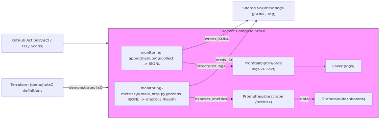
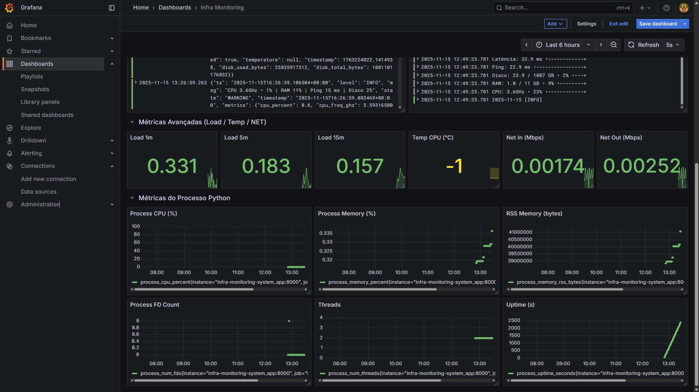

# Infra Monitoring System

---

## 📘 Visão geral

Aplicação para coleta e exposição de métricas de sistema local, projetada para praticar desenvolvimento em Python e o uso de automação, CI/CD e ferramentas de observabilidade.
Princípios e detalhes operacionais (coleta, formatos e integrações) estão consolidados em `docs/DECISIONS.md`. Instruções de execução estão em `docs/RUN.md`.

Este arquivo é o mergulho técnico:

- Foca em arquitetura, modelo de execução e escolhas operacionais.
- Não é um relatório de auditoria e não é um espelho do `README.md` raiz.
- Linka para logs de decisões e runbooks em vez de duplicá-los.

---

## 🖼️ Artefatos / Evidências

Uma seleção compacta de evidências visuais (diagramas, dashboards e capturas de execução). As imagens em tamanho real estão organizadas em uma galeria dedicada para manter este README conciso e de fácil leitura.

<div>
   <a href="prints/README.md"></a>
   <a href="prints/README.md"></a>
</div>

[Ver galeria completa →](prints/README.md)

---

## 🧩 Arquitetura & Fluxo

1. **Integração Contínua (CI)** — valida código, dependências e testes.
2. **Cobertura de Testes** — mede a cobertura automatizada.
3. **Entrega Contínua (CD)** — constrói e publica a imagem Docker.
4. **Automação de Segurança:**
   - Dependabot (dependências)
   - TruffleHog (detecção de segredos)
   - Snyk (vulnerabilidades em pacotes)
   - Trivy (análise de imagem)
5. **Infrastructure as Code (IaC)** — Terraform está incluído como módulo educacional e é validado em CI, mas não é aplicado automaticamente.

Postura de entrega (alto nível): o CD foi desenhado para ativação controlada. Etapas que exigem credenciais/permissões podem ser protegidas ou não serem padrão, assim o pipeline permanece seguro enquanto documenta o fluxo pretendido.

---

## ⚙️ Execução local

```shell
git clone https://github.com/Jeferson681/infra-monitoring-system.git
cd infra-monitoring-system
docker compose -f docker/docker-compose.yml up --build
```

**Serviços locais:**
- Prometheus → http://localhost:9090
- Grafana → http://localhost:3000
- Loki → http://localhost:3100
- Exporter → http://localhost:8000/metrics (somente acessível do host se `ports:` estiver publicado; veja `docs/RUN.md`)

Execução via virtualenv (veja `docs/RUN.md` para comandos específicos por plataforma e ativação do exporter):

```shell
python -m venv .venv
source .venv/bin/activate
pip install -r requirements.txt
```

Observação sobre exposição de métricas:

O projeto registra métricas Prometheus via exporter (ativar com `MONITORING_EXPORTER_ENABLE=1`). Servir o endpoint HTTP `/metrics` é uma responsabilidade separada: no Compose o serviço `main_http` fornece o endpoint `/metrics` que o Prometheus coleta, e localmente é possível iniciar o servidor HTTP de fallback definindo `MONITORING_HTTP_ENABLE=1`. Habilitar o exporter registra as métricas; servir `/metrics` depende de `main_http` (Compose) ou do servidor HTTP de fallback — não habilite ambos ao mesmo tempo para evitar conflitos de bind de porta. Veja `docs/RUN.md` para detalhes e observações sobre acessibilidade a partir do host.

Para detalhes sobre ativação do exporter, limites do `psutil` e persistência em JSONL, veja `docs/DECISIONS.md`.

---

## 🏗️ Estrutura do diretório

```
infra-monitoring-system/
├── src/                  # Código-fonte principal
├── tests/                # Testes automatizados
├── infra/                # Configurações (promtail, terraform, prometheus)
│   └── terraform/        # Módulo IaC demonstrativo
├── .github/workflows/    # Pipelines de CI/CD
├── docker/Dockerfile     # Imagem Docker
├── docker/docker-compose.yml  # Orquestração de containers
└── README.md
```

---

## 🧑‍💻 Pilha tecnológica

- **Linguagem:** Python
- **Monitoramento:** Prometheus, Grafana, Loki
- **Orquestração:** Docker, Docker Compose
- **IaC:** Terraform
- **Pipeline:** GitHub Actions
- **SO:** Linux, WSL2 e Windows nativo

---

## 🔒 Segurança & Conformidade

- **TruffleHog** — evita exposição de segredos.
- **Snyk** — detecta vulnerabilidades em dependências.
- **Trivy** — escaneia imagens Docker.
- **Dependabot** — mantém dependências atualizadas e seguras.

Todos os checagens são automatizados via pipelines do GitHub Actions.

Webhook & segredos:

- O webhook do Discord (quando usado) é gerenciado via GitHub Actions Secrets e não é commitado no repositório.
- Tokens e chaves de acesso usadas pelos pipelines devem ficar em `Settings > Secrets and variables > Actions`.

---

## ⚠️ Limitações conhecidas

- A coleta de métricas do host não é garantida dentro de containers.
- O exporter depende da persistência local em JSONL e expõe o snapshot mais recente.
- Endpoints HTTP não são autenticados (indicados para uso local/demonstração).

---

## 🏕️ Terraform (IaC demonstrativo)

Terraform é incluído como um módulo didático (veja `infra/terraform/`).

- O CI valida a configuração (format/lint/validate).
- Ele não é aplicado automaticamente por design.
- O objetivo é documentar e revisar uma estrutura declarativa esperada, não provisionar infraestrutura real como parte da coleta local de métricas.

Se desejar adaptar para ambientes reais, use uma conta/workspace isolada e revise segredos/permissões antes de aplicar.

---

## 📎 Licença

Distribuído sob a licença **MIT**.
Portal de documentação disponível em [`/docs/DOCS.md`](./DOCS.md).
