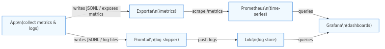
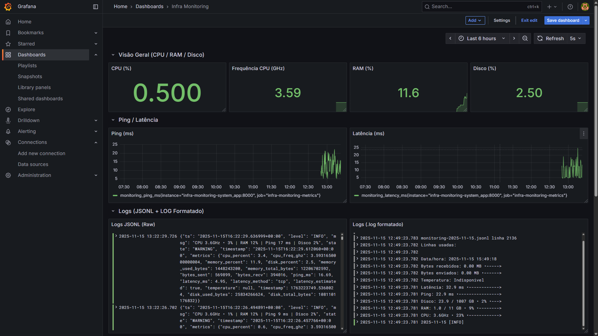
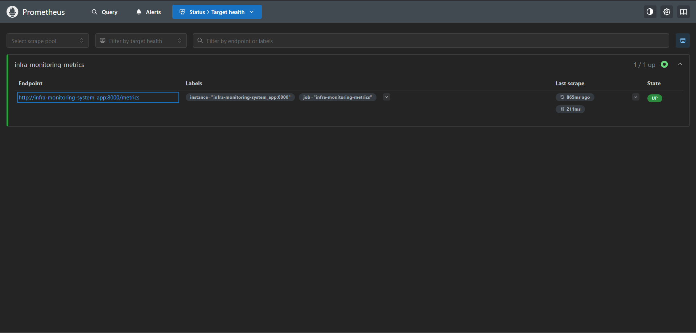
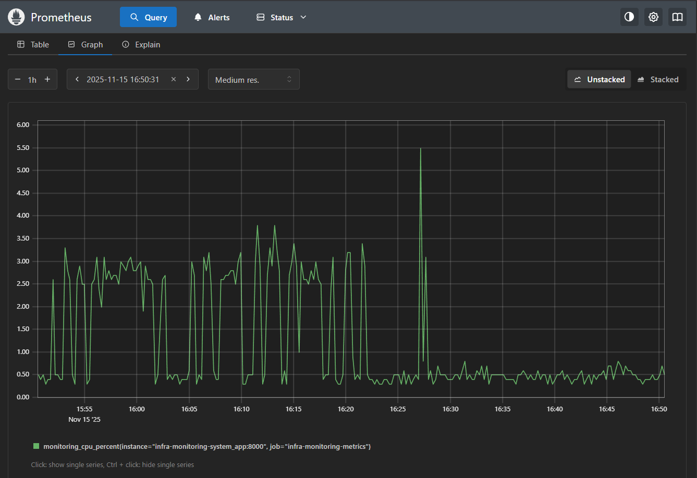
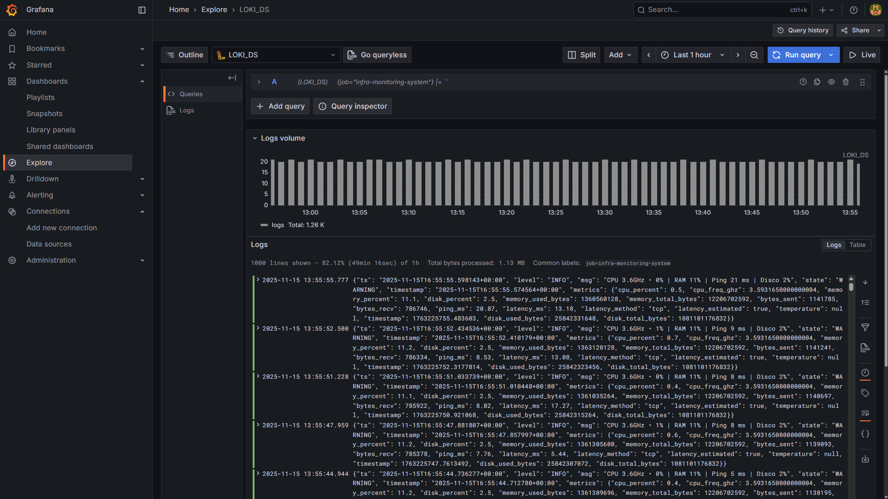
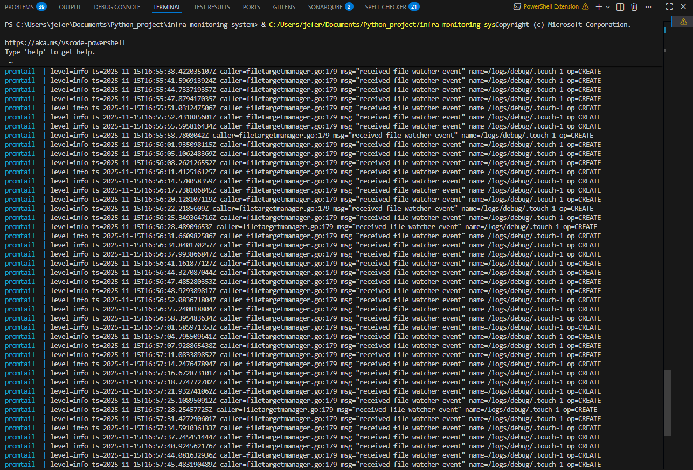
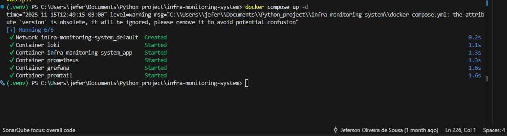
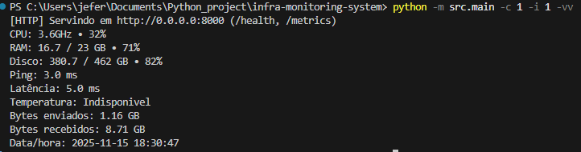
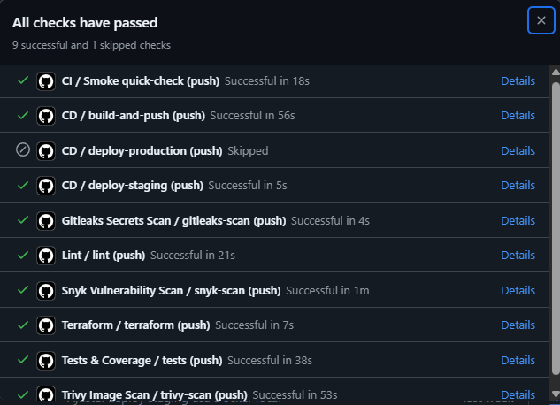

 # Galeria de Prints / Artefatos

Esta pasta contém capturas de tela e diagramas selecionados que servem como evidência do trabalho de observabilidade e das pipelines CI do projeto. As imagens são apresentadas de forma compacta com legendas; clique na miniatura para ver o arquivo em tamanho real.

> Apresentação pensada para avaliadores e recrutadores: minimalista, profissional e de leitura rápida.
---

<table>
  <tr>
    <td align="center">
      
      
<strong>Architecture</strong> <small>System components & flows</small>

    </td>
    <td align="center">
      
      
<strong>Simple Flow</strong> <small>High-level data flow</small>

    </td>
  </tr>
  <tr>
    <td align="center">
      
      
<strong>Grafana Dashboard</strong> <small>CPU / Memory / Disk panels</small>

    </td>
    <td align="center">
      
      
<strong>Grafana Detail</strong> <small>Panel detail view</small>

    </td>
  </tr>
  <tr>
    <td align="center">
      
      
<strong>Prometheus Targets</strong> <small>Targets UP</small>

    </td>
    <td align="center">
      
      
<strong>Prometheus Graph</strong> <small>Sample query result</small>

    </td>
  </tr>
  <tr>
    <td align="center">
      
      
<strong>Grafana Explore</strong> <small>Loki logs query</small>

    </td>
    <td align="center">
      
      
<strong>Promtail Logs</strong> <small>Log shipping evidence</small>

    </td>
  </tr>
  <tr>
    <td align="center">
      
      
<strong>Containers Running</strong> <small>docker compose ps</small>

    </td>
    <td align="center">
      
      
<strong>Local Run</strong> <small>Exporter serving / health</small>

    </td>
  </tr>
  <tr>
    <td align="center">
      
      
<strong>CI Pipeline</strong> <small>GitHub Actions run</small>

    </td>
    <td/>
  </tr>
</table>

---

Cada imagem é um instantâneo gerado durante testes locais e execuções de CI. Use estes artefatos para preparar uma demo curta ou para inclusão no portfólio; estão intencionalmente compactos para manter a apresentação limpa.
