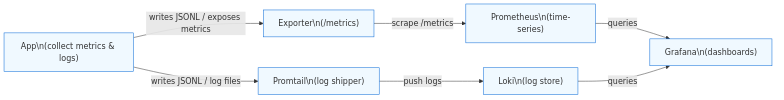
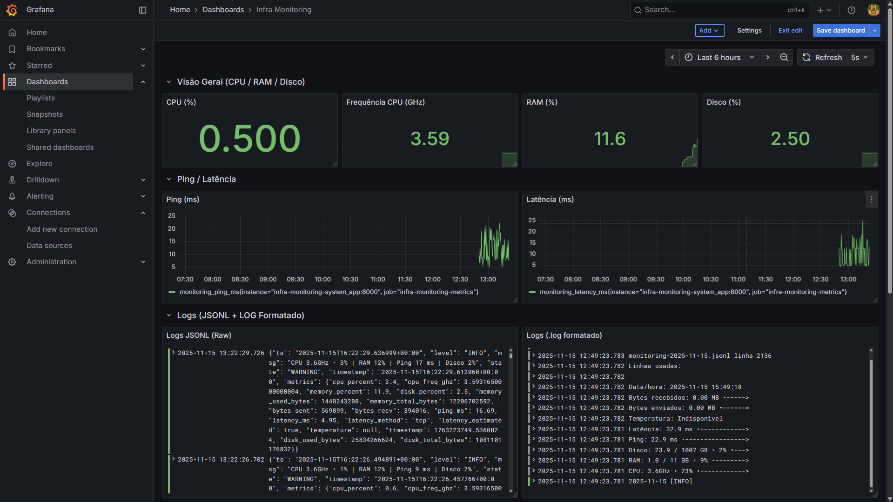
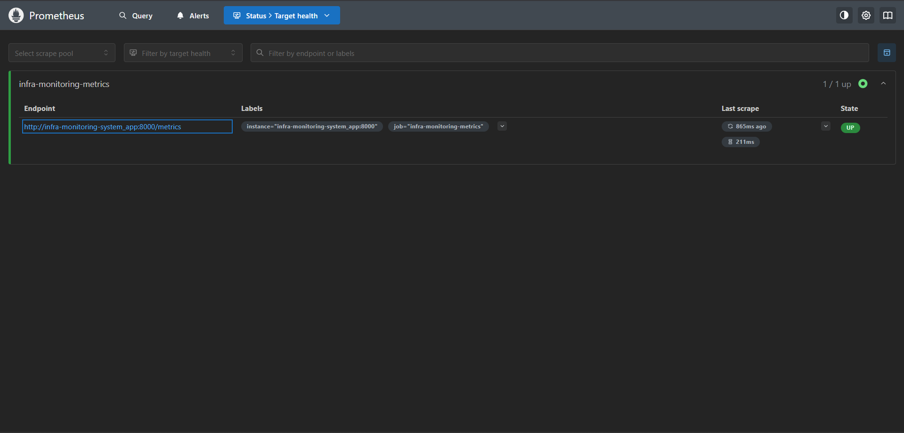
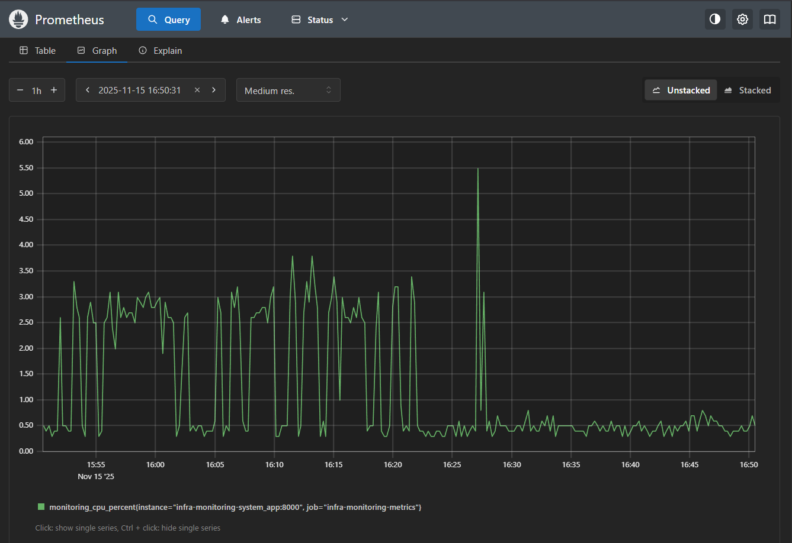
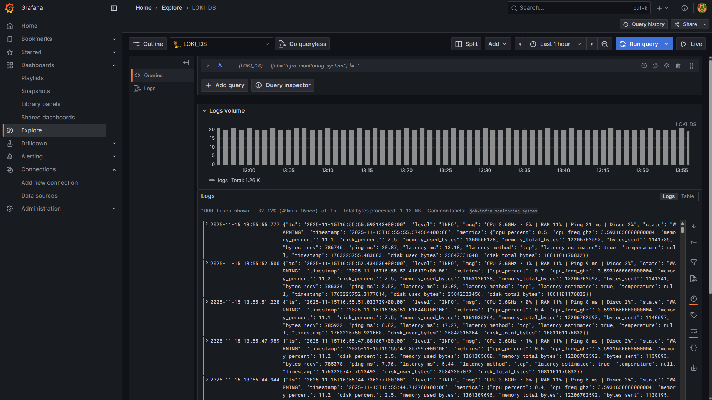
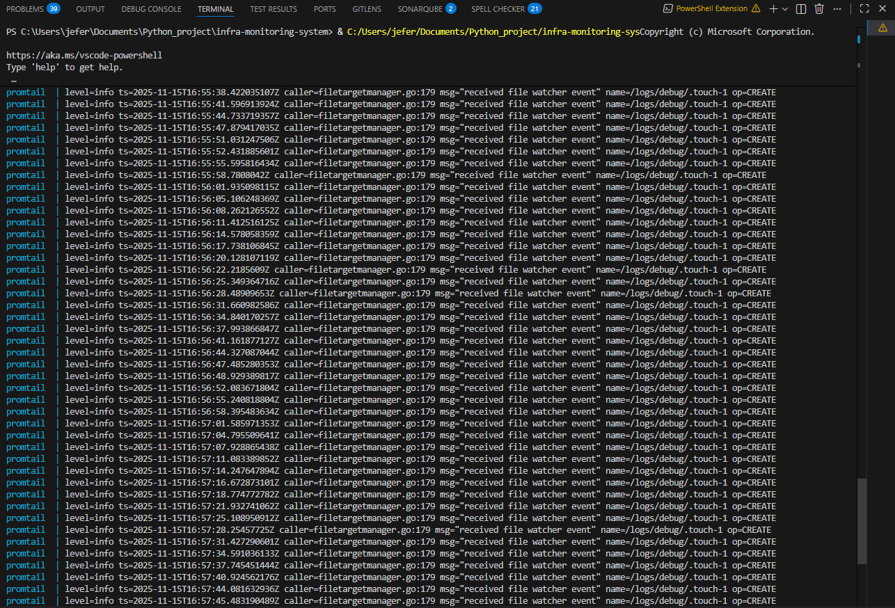
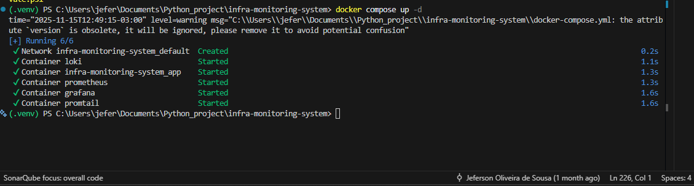
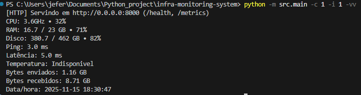
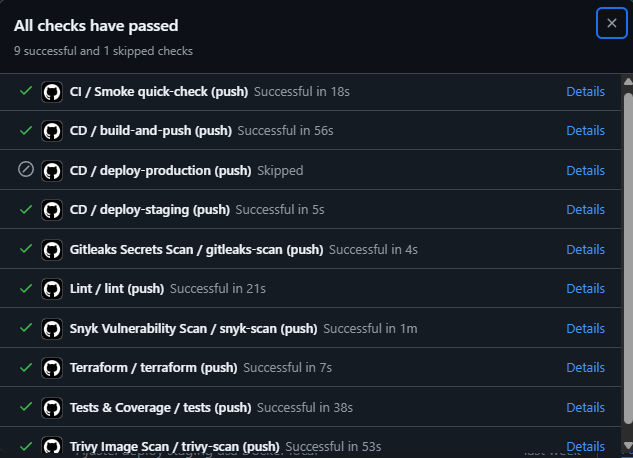

 # Prints / Artifacts Gallery

This folder contains selected screenshots and diagrams that serve as evidence of the project’s observability work and CI pipelines. Images are displayed compactly with captions; click a thumbnail to open the full-size file.

> This presentation is designed for reviewers and recruiters: minimal, professional, and quick to scan.
---

<table>
  <tr>
    <td align="center">
      
      
<strong>Architecture</strong> <small>System components & flows</small>

    </td>
    <td align="center">
      
      
<strong>Simple Flow</strong> <small>High-level data flow</small>

    </td>
  </tr>
  <tr>
    <td align="center">
      
      
<strong>Grafana Dashboard</strong> <small>CPU / Memory / Disk panels</small>

    </td>
    <td align="center">
      
      
<strong>Grafana Detail</strong> <small>Panel detail view</small>

    </td>
  </tr>
  <tr>
    <td align="center">
      
      
<strong>Prometheus Targets</strong> <small>Targets UP</small>

    </td>
    <td align="center">
      
      
<strong>Prometheus Graph</strong> <small>Sample query result</small>

    </td>
  </tr>
  <tr>
    <td align="center">
      
      
<strong>Grafana Explore</strong> <small>Loki logs query</small>

    </td>
    <td align="center">
      
      
<strong>Promtail Logs</strong> <small>Log shipping evidence</small>

    </td>
  </tr>
  <tr>
    <td align="center">
      
      
<strong>Containers Running</strong> <small>docker compose ps</small>

    </td>
    <td align="center">
      
      
<strong>Local Run</strong> <small>Exporter serving / health</small>

    </td>
  </tr>
  <tr>
    <td align="center">
      
      
<strong>CI Pipeline</strong> <small>GitHub Actions run</small>

    </td>
    <td/>
  </tr>
</table>

---

Each image is a snapshot generated during local tests and CI runs. Use these artifacts for a short demo or portfolio inclusion; they are intentionally compact to keep the presentation clean.
